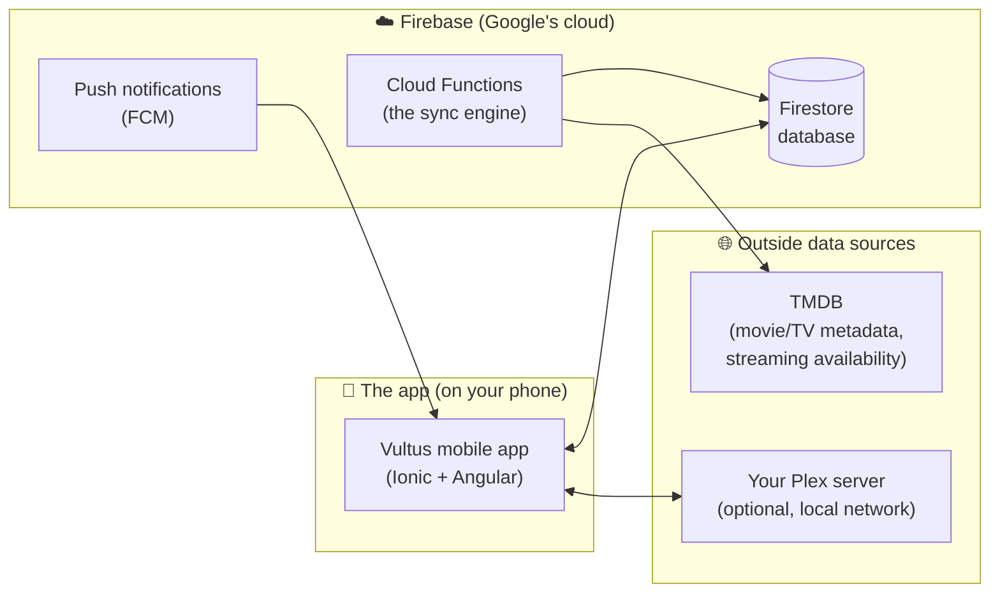
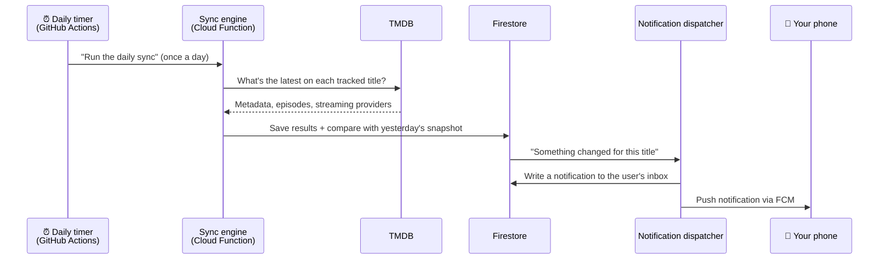

# Vultus — Architecture Overview

**Audience:** anyone who wants to understand how Vultus works without reading
code — product owners, reviewers, new contributors.

**Relationship to other docs:** this is the plain-language companion to
[`docs/PLAN.md`](PLAN.md), which remains the technical source of truth for
architecture decisions. If the two ever disagree, PLAN.md wins.

---

## What is Vultus?

Vultus is a personal Android app for tracking movies and TV shows. You add
titles to a watchlist, and the app tells you:

- **Where you can watch them** — which streaming service (Netflix, Prime,
  Disney+, …) carries each title in your region.
- **When something new is ready** — a push notification the day a new episode
  airs, or the day a movie on your list appears on a streaming service.
- **What you've already seen** — watch progress per episode and per movie.

It is built for a single user today, but the data is structured so that adding
more users later is straightforward.

---

## The big picture

Vultus has three main parts:



| Part                      | What it is                                                                                                    | What it does                                                                                                                   |
| ------------------------- | ------------------------------------------------------------------------------------------------------------- | ------------------------------------------------------------------------------------------------------------------------------ |
| **The mobile app**        | An Android app built with Ionic + Angular, packaged as a native app via Capacitor                             | Everything you see and tap: watchlist, search, title details, the "Watch Today" tab, notifications inbox, settings, onboarding |
| **The Firebase backend**  | Google's cloud platform: a database (Firestore), server-side code (Cloud Functions), and push messaging (FCM) | Stores your data, runs the daily sync, and sends push notifications                                                            |
| **External data sources** | TMDB (a free public API), plus optionally your own Plex server                                                | Provide movie/TV metadata, streaming availability per region, and (via Plex) what you've already watched                       |

There is no custom server to maintain. The backend is entirely
"serverless" — small pieces of code that Firebase runs on demand — which keeps
the running cost at effectively €0/month.

---

## How the core flow works: "you get notified"

The app's main promise — _tell me the day something becomes watchable_ — works
like this:



1. **Once a day**, a scheduled timer (a GitHub Actions cron job) tells the
   sync engine to run. You can also trigger a refresh manually from the app
   (limited to once per 5 minutes).
2. **The sync engine** asks TMDB for the current state of every tracked
   title: metadata, episode air dates, and which streaming services carry it
   in your region.
3. **The trick is the comparison.** The engine keeps yesterday's snapshot and
   compares it with today's. "Yesterday this movie was _not_ on Netflix NL;
   today it _is_" — that transition is what triggers a notification. This
   also guards against noisy or slightly inaccurate availability data.
4. **The notification dispatcher** writes the event to your in-app
   notifications inbox and pushes it to your phone via Firebase Cloud
   Messaging (FCM).

A "sync health" view in the app's settings shows when the last sync ran and
whether it succeeded, so a silently failing sync is visible.

### Optional: Plex integration

If you run a Plex media server at home, the app can connect to it directly
over your local network and mark things you watched on Plex as watched in
Vultus (one-way sync, Plex → Vultus). This happens entirely on the phone —
your Plex data never goes through the cloud.

---

## How the data is organized

All data lives in Firestore, Google's cloud database, in two groups:

**Per-user data** — everything under your user record:

- **Watchlist** — each tracked title with its status (_watching, planned,
  completed, dropped_) and, for TV shows, per-episode watched flags.
- **Notifications inbox** — every notification you've received, read or
  unread.
- **Preferences** — your region, which streaming providers you subscribe to,
  quiet hours, and your device's push-notification tokens.

**Shared data** — written only by the backend, read by the app:

- **Title cache** — metadata and streaming availability per title per region,
  including yesterday's snapshot (used for the transition detection above).
  This is shared across users: if two users track the same show, it is synced
  once, which keeps the daily sync cheap.
- **Provider catalog** — the list of streaming services per region.
- **Sync runs** — a log of each sync run, powering the sync-health view.

Security rules ensure the app can only read/write the signed-in user's own
data, and can never write to the shared data — only the backend can.

---

## How the code is organized: vertical slices

The codebase is one repository (an Nx "monorepo") containing the app, the
backend, and shared building blocks. The organizing principle is **vertical
slices**: each feature is a self-contained package that owns everything it
needs — its screens, logic, data access, and types.

```
apps/
  mobile          → the app shell (tabs, routing, startup)
  functions       → the backend entry points
libs/
  mobile/         → one slice per app feature:
                    watchlist, search, title-detail, today,
                    settings (incl. Plex), onboarding, notifications
  functions/      → one slice per backend job:
                    sync-titles, sync-episodes, dispatch-notifications
  shared/         → the only code slices may share:
                    domain types, database schema, UI kit (theme + widgets)
```

**Why slices?** So a change to one feature cannot quietly break another. The
rule "slices may not import from each other" is not a convention that relies
on discipline — it is enforced by a lint tool (Sheriff) that fails the build
on any violation. Slices communicate only through the small `shared/` layer.

A deliberate consequence: some code is _duplicated_ between slices rather
than shared. That is by design — two features that look similar today often
evolve differently, and premature sharing couples them. Code moves to
`shared/` only when three or more slices need the exact same thing.

---

## How the design stays consistent

The visual design lives in **Google Stitch** (project "Vultus Android App
Design") — dark-first, emerald-green accent, Inter font. Its design tokens
(colors, spacing, typography) are exported into the repository
([`docs/design/vultus-design-system.md`](design/vultus-design-system.md)) and
wired into the shared UI kit's theme. When a screen is built, the Stitch
screen is the spec — the implementation is expected to match it, not
approximate it.

---

## How work gets done and stays safe

Development is **spec-driven**: every feature starts as a written
specification (`docs/specs/NNNN-slug.md`) that is reviewed and merged before
any code is written. The spec is the unit of work — there are no GitHub
issues. Implementation is largely done by AI agents following the merged
spec, with a human reviewing every pull request. `docs/specs/STATUS.md` is
the live ledger of what has shipped.

Every change must pass an automated quality gate before it can merge:

- **Type checking and linting** — including the Sheriff slice-boundary rules.
- **Unit and component tests** — the logic of every changed slice is tested.
- **End-to-end tests** — 13 critical user flows (onboarding, search,
  watchlist, notifications, …) are run against an emulated Firebase backend.
- **A full build** of every affected part.

`main` is always deployable; backend changes ship to Firebase through a
dedicated deploy pipeline with its own pre-flight checks.

---

## Cost and constraints, in one paragraph

Vultus targets **~€0/month**. Firebase's pay-as-you-go plan is required to
run Cloud Functions, but personal-scale usage sits far inside the free
allowances; TMDB is free for non-commercial use; the daily timer
runs on GitHub Actions' free tier. The known open risk is the accuracy of
per-region streaming-availability data (TMDB's is decent but imperfect) — the
snapshot-comparison design softens this, and a more accurate paid-tier source
(Watchmode) is the identified fallback if accuracy proves poor in practice.
